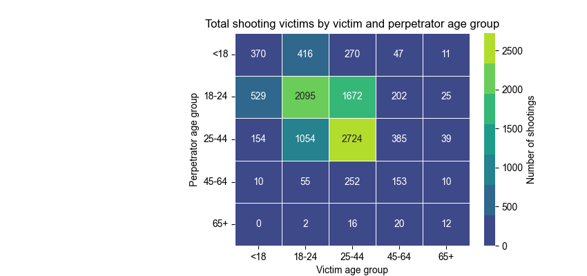

*By Bastian Gulstad Ravn (s214727)* 

* * *
* * *

Gun crime is a major topic in modern America. In 2023, nearly 47.000 people in the US died from gun related injuries [[1]](https://www.pewresearch.org/short-reads/2025/03/05/what-the-data-says-about-gun-deaths-in-the-us/). Compared to other large western nations, the US has significantly higher rates of gun violence. For example, firearm homicide rates in the US are 19 times greater than in France and 77 times greater than in Germany [[2]](https://www.healthdata.org/news-events/insights-blog/acting-data/gun-violence-united-states-outlier). It is a controversial debate however, as the question of gun ownership is a matter of constitutional right. In this project, we take an analytical approach to investigating the shooting data in the largest city in the US - New York City.

The dataset on which this analysis is built is the historic NYPD Shooting Incident Dataset which is available on the NYC OpenData portal. The dataset can be found [here](https://data.cityofnewyork.us/Public-Safety/NYPD-Shooting-Incident-Data-Historic-/833y-fsy8/about_data). It contains details of every shooting incident in NYC in the time period 2006-2023. It has approximately 29000 observations each containing interesting features such as date, time and location of the shooting as well as age group, race and sex of both the perpetrator and the victim. 

* * *

## An overview of shooting incident data in NYC
To get a general overview of the number of shooting incidents in NYC, let us visualize how the number of shootings has changed with the years. In figure 1 we see the yearly number of shootings in all of NYC throughout the whole time period. The number of occurences appears relatively stable in the late 2010s followed by a period of significant drop in occurences until the large spike in 2020/2021. In 2022 and 2023 the number of occurences start dropping rapidly again. It is difficult to qualify what caused the prolonged drop in shooting incidents up until 2020, but it is not a phenomenon isolated to NYC. According to a report [[3]](https://bjs.ojp.gov/library/publications/trends-and-patterns-firearm-violence-1993-2018) by BJS, the rate of firearm violence declined significantly in the time period 1993-2018.

The surge of gun violence in 2020 can likely be attributed to a few factors. Firstly, the New York police department (NYPD) saw its resources stretched thin in 2020 due to the outbreak of the Covid-19 pandemic. Additionally, massive protests following the murder of George Floyd further weakened ability of the NYPD to be present in and around the city [[4]](https://www.nyc.gov/site/nypd/news/p0106a/overall-crime-new-york-city-reaches-record-low-2020).

> Figure 1: Yearly shooting incidents in NYC.

Let us take a look at the distribution of shootings across the city. Figure 2 displays an interactive map of NYC in which shooting incidents have been grouped into clusters. Additionally, each borough of the city has been colored according to the total number of shootings in the whole time period. Clicking on an empty area will display the name of the borough. Clicking a specific cluster will further zoom in on the cluster. It becomes clear that certain parts of NYC are more heavily impacted. Many of the larger clusters are centered around the boroughs Brooklyn and Bronx. In Brooklyn, shooting incidents seem especially prevelant around the Flatbush and Brownsville (East New York) neighbourhoods. In Bronx, areas near Melrose and Tremont are severely impacted. Unsurprisingly, these neighbourhoods are all among the lowest household-income neighbourhoods in NYC [[5]](https://a816-dohbesp.nyc.gov/IndicatorPublic/data-explorer/economic-conditions/?id=103#display=summary).

<html>
<head>
</head>
<body>
    <iframe src="cluster_map2.html" width="800" height="510"></iframe>
    </body>
</html>
> Figure 2: Distribution of shooting incidents across NYC.

We now visualize the number of shootings by month for each borough. The plot on figure 3 is interactive and and allows for selection of the borough(s) for which the distribution across the year should be displayed. The general trend is that the summer months are the peak of shooting incidents across for all the five boroughs. This stems with numerous studies (e.g. [[Esfandi]](https://esfandilawfirm.com/do-seasons-weather-affect-crime-trends/#:~:text=According%20to%20the%20U.S.%20Bureau,as%20the%20weather%20gets%20hotter.)) that conclude that violent crime, in general, seems to peak during the summer.
<html>
<head>
</head>
<body>
    <iframe src="bokeh_shootings_by_month2.html" width="800" height="510"></iframe>
    </body>
</html>
> Figure 3: Distribution of shooting incidents across boroughs by month.

## A look into the demographics of NYC shootings
So we know that shootings in NYC tend to concentrate around certain neighbourhoods as well as certain months of the year. In order to better characterize the shooters and shooting victims, We display the victim and perpetrator counts for both sexes on figure 4. For this visualization we use only observations of the dataset for which both the age group and the sex of the perpetrator is reported. One should always be careful when ignoring significant parts of the dataset for the purpose of comparison between categories. Doing this, one can potentially introduce unintended bias into the illustration and thus also the analysis. An example could be if e.g. females in the 45-64 age group were heavily over represented among perpetrators that were never caught. For this analysis we choose to make the assumption that all shooting perpetrators are equally likely to be caught/seen (and thus have their demographics reported) regardless of age and sex. Assuming this to be true, we avoid the aforementioned bias.

It should also be noted that the age group intervals for this dataset, unfortunately, are quite broad and not of equal length. As such, we should keep this in mind when comparing the different groups. From the plot a few things become clear. Males are heavily over represented among both shooting victims and shooting perpetrators. Females are much less likely to be victims of a shooting, and even less likely to be the perpetrators. Additionally, males in the age group 18-24 are over represented compared to the much broader age category 25-44. This points towards an issue with gang culture, which is predominantly associated with young males. 

> Figure 4: Victim and perpetrator statistics across sex and age group.

The plot in figure 4 opens up an interesting question of the relations between the sexes of perpetrators and victims. As we already know, males are much more likely to be both victims and perpetrators. From the statistics in Table 1 however, we learn something interesting. If we take a look at the two most extreme statistical differences between the sexes, we see that in the case where the perpetrator is female, the victim is about 4 times as likely to be male as they are to be female. I.e. it is not that rare (relatively) for females to shoot other females. On the other hand, if the victim is male, there is only a 1/53 probability that the perpetrator is female. Overall, the key takeaway here is that even though both males and females are most likely to be involved in shootings with males, females are much more likely to be involved in shootings with females, than males are to be involved in shootings with females.

> Table 1: Victim/perpetrator ratios across sexes.

Another interesting point to investigate based on figure 4 is the relation between age groups of victims and perpetrators. On figure 5 we have a heatmap of the different pairs of victim/perpetrator age groups. Each square is colored according to the number of shootings for that given pair. The heatmap has a somewhat diagonal structure, suggesting that people are more likely to shoot people within their own age group, or at least close to it.

> Figure 5: Total shootings by victim and perpetrator age group.

One interesting statistic we have not yet discussed is the lethality of shootings and how it changes with different variables. On figure 6 we visualize a heatmap of the lethality ratios (percentage of shootings that are lethal to the victim) of the different pairs of victim age group and victim race. It should be noted that there are a very limited number of shooting incidents for some races, which results in e.g. there being no *lethal* shooting incidents for persons of "american indian/alaskan native" origin.

We see that in general, the lethality of shootings tend to increase with the age of the victims. A likely reason for this is that the human body simply is less likely to survive a gunshot the older it gets. Another reason might also be that the level of violence of the type of shootings which older age groups tend to be involved in, is higher. Additionally we see that although black people are more likely to be involved in shootings, the shootings that white people are involved in tend to be more lethal.

> Figure 6: Lethality ratio of shootings by victim race and age group.

## Summarizing conclusions
Summarizing the findings our analysis of shooting incidents in NYC, we present a few important conclusions. Firstly, there are clear trends in the number of shooting occurences with regards to time and place in NYC. The number of shootings saw a steady decline throughout the years until 2019, when a resurgence in shootings occured. With regards to the different boroughs, Brooklyn and Bronx are by far the most dangerous when it comes to shootings, and hence also the places where the majority of police effort should be focused. Furthermore, in each borough the most dangerous time of the year is during summer.

When it comes to demographic patterns, young males unsurprisingly make up the majority of both victim and perpetrator statistics. This aligns with the typical demographics of people involved with criminal gangs. However, it was found that in the case where the victim is female, the perpetrator is much more likely to be female than when the victim is male - and similarly in the case where the perpetrator is female. There are also clear trends in age group data that suggest people are more likely to shoot people in their own age group. These are all general patterns that can potentially narrow down the search of perpetrators for shooting incidents in which the perpetrator has not yet been caught.
